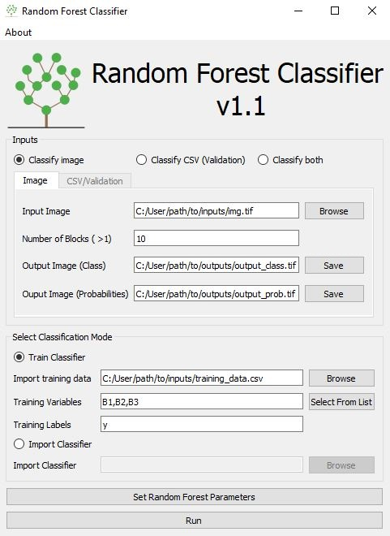

# GeoRasterRF
The repository contains a Python program with a graphical user interface developed to classify geospatial images using the Random Forest algorithm.

{ width=50% }

## Installation
Follow installation instructions to use the classifier.
### Clone repository
Navigate to your working directory and clone the repository.
```
git clone https://github.com/danielm09/GeoRasterRF.git
```
### Install dependencies
The program requires the following packages installed: numpy, pandas, gdal, scikit-learn and pyqt.
Use the environment.yml file to create conda environment with required packages.
```
conda env create -f environment.yml
```
> *Make sure the command is executed from the GeoRasterRF directory.*

Activate conda environment.
```
conda activate rf_gui
```
## Usage
Run main.py to open the Graphical User Interface.
```
python main.py
```
Select type of classification: classify raster only, classify csv file only or classify both.  
Select inputs and outputs accordingly.  
Select whether to train a new classifier or load an existing model (*.pkl*).  
Optionally, set Random Forest parameters.

Click Run.




